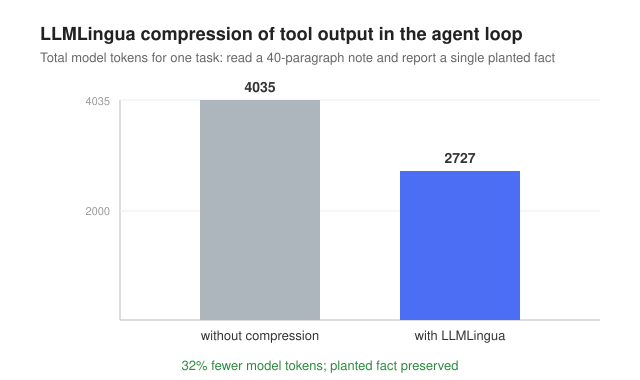

# Caduceus

An open, single-agent **coding agent** that runs on [Ollama Cloud](https://docs.ollama.com/cloud). Give it a task in your terminal (or browser) and it inspects the workspace, edits files, runs commands, and verifies its work in a bounded reason-act loop — with skills, a knowledge layer, memory, prompt compression, sandboxing, subagents, MCP tools, and a streaming CLI/Web UI.

TypeScript · pnpm · Ollama Cloud (OpenAI-compatible). Built from scratch; architecture modeled on the Hermes Agent framework.

The design is grounded in a documented research phase. See
[docs/ARCHITECTURE.md](docs/ARCHITECTURE.md) for how it is built and why,
[docs/BENCHMARKS.md](docs/BENCHMARKS.md) for what has been measured, and
[docs/REFERENCES.md](docs/REFERENCES.md) for the sources.

```text
step 1
  call: write_file({"path":"greet.js","content":"console.log('hello from caduceus');"})
  ok:   write_file
step 2
  call: bash({"command":"node greet.js"})
  ok:   bash
step 3
  I created greet.js and ran it; it printed "hello from caduceus".

8253 tokens, 12.3s, 3 steps
```

## Features

- **Bounded reason-act loop** with a circuit breaker and a per-task step budget.
- **Tools:** `read_file` (with line ranges), `write_file`, `str_replace` (one unique edit), `multi_edit` (several atomic edits), `bash`, `search_code` (ripgrep with a grep fallback), `list_files`, `update_plan` (track multi-step work).
- **Skills** — procedural know-how as `SKILL.md` folders with progressive disclosure; the agent can `create_skill` at runtime (Voyager-style).
- **Skills hub** — search and install community skills from GitHub or a URL, gated by a security scanner (threat patterns + structural + invisible-unicode) and a trust policy, with quarantine, a provenance lockfile, and an audit log.
- **Command palette** — the interactive TUI has slash commands (`/help`, `/tools`, `/skills`, `/model`, `/sandbox`, …) with autocomplete and a live status bar.
- **Knowledge (OKF)** — a Markdown concept bundle ([Open Knowledge Format](https://github.com/GoogleCloudPlatform/knowledge-catalog/tree/main/okf)) the agent reads and authors.
- **Memory** — flat-file episodic lessons (`remember`/`recall`), strict-write.
- **Prompt compression** — real [LLMLingua](https://github.com/microsoft/LLMLingua) via a Python sidecar (opt-in).
- **Sandboxing** — env scrubbing always on; bubblewrap OS isolation (network off) with graceful degradation.
- **Subagents** — `delegate` runs isolated subagents for independent, parallel investigation.
- **MCP connectors** — connect to Model Context Protocol servers and use their tools.
- **Multi-turn** — an interactive Ink TUI and a Hermes-style Web UI, both with session persistence, on one shared engine.
- **Reliable** — retries with backoff, request timeouts, optional model fallback, usage reporting.

## Install & run

```bash
pnpm install
export OLLAMA_API_KEY=...        # from https://ollama.com

pnpm dev "summarize this project"   # one-shot task
pnpm dev                            # interactive TUI (multi-turn chat)
pnpm web                            # web UI at http://localhost:4100
```

Build a distributable CLI:

```bash
pnpm build
node dist/cli.js "your task"   # or: caduceus "your task" / caduceus-web
```

The CLI and the web server drive the same headless engine (`src/engine/session.ts`, via `run()` and `Conversation`).

### Skills hub

Install community skills, with a security scan and recorded provenance:

```bash
caduceus skills search pdf                          # search GitHub taps + catalog
caduceus skills inspect anthropics/skills/skills/pdf
caduceus skills install anthropics/skills/skills/pdf   # scan, confirm, install
caduceus skills install https://example.com/SKILL.md   # single-file skill from a URL
caduceus skills list                                # installed skills + provenance
caduceus skills audit                               # the install audit log
caduceus skills tap add owner/repo                  # add a custom GitHub source
```

Trusted repos (`anthropics/skills`, `openai/skills`) may install `caution`-rated skills; community sources are blocked on any finding unless you pass `--force`. State lives in `<skills-dir>/.hub/` (lockfile, audit log, taps, quarantine). Set `GITHUB_TOKEN` to raise GitHub's rate limit.

## Configuration

| Variable | Default | Purpose |
| --- | --- | --- |
| `OLLAMA_API_KEY` | _required_ | Ollama Cloud API key |
| `OLLAMA_BASE_URL` | `https://ollama.com/v1` | OpenAI-compatible endpoint |
| `CADUCEUS_MODEL` | `qwen3-coder:480b-cloud` | Model id |
| `CADUCEUS_FALLBACK_MODEL` | _unset_ | Model tried once if the primary keeps failing |
| `CADUCEUS_MAX_STEPS` | `20` | Loop iteration budget |
| `CADUCEUS_TEMPERATURE` | `0` | Sampling temperature |
| `CADUCEUS_RETRIES` | `3` | Attempts per request (backoff on 429/5xx/network) |
| `CADUCEUS_TIMEOUT_MS` | `120000` | Per-attempt request timeout |
| `CADUCEUS_STREAM` | `0` | `1` streams the model's output live |
| `CADUCEUS_APPROVAL` | `prompt` if interactive, else `allow` | Gate risky shell commands: `allow` / `deny` / `prompt` |
| `CADUCEUS_SANDBOX` | `auto` | `off` / `auto` / `on` (require bwrap) |
| `CADUCEUS_SANDBOX_NET` | `0` | `1` to allow network inside the sandbox |
| `CADUCEUS_COMPRESS` | `0` | `1` compresses large tool output via LLMLingua |
| `CADUCEUS_SKILLS_DIR` / `_KNOWLEDGE_DIR` / `_MEMORY_DIR` / `_ARTIFACTS_DIR` | `skills` / `knowledge` / `memory` / `artifacts` | Where each layer lives |
| `CADUCEUS_MCP_CONFIG` | `.caduceus/mcp.json` | MCP servers config |

CLI flags `--model` and `--max-steps` override the environment.

## How it works

The system prompt is assembled in three tiers — **stable** (identity, tools, skill catalog), **context** (project files, OKF knowledge, memory, artifacts), **volatile** (timestamp) — in that order, so the long prefix stays cache-friendly. Skills and OKF knowledge share one Markdown+frontmatter substrate (`src/markdown/frontmatter.ts`). A `Conversation` keeps history across turns; sessions persist to `.caduceus/sessions`.

- **MCP:** drop a `.caduceus/mcp.json` (`{ "mcpServers": { "name": { "command": "...", "args": [...] } } }` for stdio, or `{ "url": "..." }` for HTTP); tools register as `mcp__<server>__<tool>`.
- **Approval:** risky shell commands (recursive deletes, piping a download into a shell, `sudo`, writes to system paths, force-push, and similar) are classified and gated. In `prompt` mode the interactive UI asks before running them; `deny` refuses them and lets the agent adapt; `allow` runs everything.
- **Sandboxing:** secret-looking env vars are stripped from tool subprocesses; with `bwrap` present, shell runs cwd-confined with network off. Without it, `auto` warns and runs unsandboxed.
- **Compression:** see [`compressor/`](compressor/) for the LLMLingua sidecar setup (`pnpm compress`).

## Design and research

Before any code, two rounds of research established the design. The full
write-ups, with verification counts and per-source quality tags, are in
[`docs/`](docs/). The three findings that shaped the system:

- Single agent, not multi-agent: error amplification rises with decentralization,
  and multi-agent systems degrade on coding benchmarks where single-agent
  baselines already exceed 45%.
- The scaffold is the product: the same model swings about 30 points on GAIA
  purely from context and tool-call management.
- Context is a tiered, file-like store assembled per turn: Google's ADK guidance,
  Google Cloud's context model, and a file-system-abstraction paper converge on
  this shape.

[docs/ARCHITECTURE.md](docs/ARCHITECTURE.md) maps each part of the system to the
research that motivated it; [docs/REFERENCES.md](docs/REFERENCES.md) lists the
sources.

## Benchmarks

The standard for a result here is a fair, reproducible measurement with equal
information given to every condition. Full details, caveats, and a retracted
result are in [docs/BENCHMARKS.md](docs/BENCHMARKS.md).

Prompt compression with the real LLMLingua-2 model, measured in the agent loop on
a large prose-context task (read a long note, report one planted fact):



Model tokens for the task fell 32% (4035 to 2727) and the planted fact was still
reported correctly. Standalone, the README compressed 52% (765 to 367 tokens).
Compression is lossy and prose-oriented, so it is opt-in and size-gated, not on
by default. Reproduce with `pnpm measure:compress` and `pnpm compress`.

## Development

```bash
pnpm typecheck   # tsc --noEmit
pnpm lint        # eslint
pnpm test        # vitest
pnpm build       # tsup to dist/
```

## License

MIT — see [LICENSE](LICENSE).
