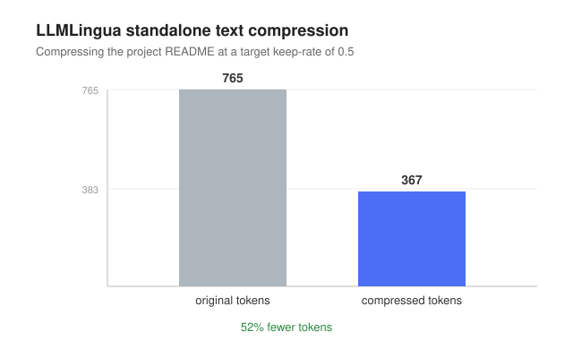

# Benchmarks and measurement

This document records what has actually been measured, how, and what it does and
does not show. The standard for inclusion is a fair, reproducible measurement
with equal information given to every condition. One result here was retracted
after it failed that standard; it is kept below because the retraction is part of
the record.

## Prompt compression (LLMLingua)

The compression layer runs the real Microsoft LLMLingua-2 model, not a heuristic
token-dropper [11]. Two measurements were taken.

### In the agent loop

Harness: `src/compress/measure.ts` (run with `pnpm measure:compress`). The agent
is given a single task: read a 40-paragraph note file and report one passphrase
planted in the middle of it. The task is run twice with identical settings,
once without compression and once with LLMLingua compressing the large
`read_file` output before it enters the message history. Real model-token usage
is recorded through the model client's usage hook, and the run also checks
whether the planted fact survived the lossy compression.

Result: total model tokens for the task fell from 4035 to 2727, a 32% reduction,
and the planted passphrase was still reported correctly. The compression paid for
itself on a large, prose-heavy context without losing the one fact that mattered.

### Standalone

Harness: `pnpm compress README.md --rate 0.5` (keep about half the tokens).

Result: the README compressed from 765 to 367 tokens, a 52% reduction.

### Caveats

These are honest, bounded results, not a blanket claim.

- Both are single runs on favorable, prose-heavy inputs.
- LLMLingua-2 is lossy and trained on prose. It can corrupt code, so it is not
  applied blindly.
- For these reasons compression is opt-in (`CADUCEUS_COMPRESS=1`) and size-gated,
  not on by default.

The defensible statement is narrow: on large prose context, LLMLingua cuts model
tokens by roughly a third to a half with no loss of the target fact in these
runs. It is a real, measured efficiency, not a universal win.

## Evaluation methodology

The research on evaluation is unambiguous that public coding benchmarks are
inflated and contaminated, that single-run numbers hide large variance, and that
the scaffold, not just the model, drives the score [14]. The principles adopted
here follow from that:

- Prefer held-out or private tasks over public suites, which leak solutions.
- Report repeated runs rather than a single lucky pass.
- Give every condition in a comparison the same information. A capability claim
  is only meaningful if the baseline had a fair chance to use the same inputs.

## A retracted result (kept for the record)

An early experiment compared Caduceus against a baseline coding agent on
"convention" tasks whose answer lived only in a knowledge-layer concept file. The
first run reported that the baseline scored 0% and Caduceus scored 100%, and this
was briefly written up as evidence that the knowledge layer changes outcomes.

It did not survive scrutiny. The comparison was confounded: Caduceus was given
the knowledge file, but the baseline was not. When the baseline was given the
same file and told to read it, it passed 5 of 5. Reading a Markdown file is not a
capability the baseline lacked. A later, larger version of the same comparison
inherited the same flaw and was retracted along with it.

The honest conclusion: the knowledge layer showed no demonstrated edge over the
obvious alternative of putting a file in the repository and reading it. On
standard coding tasks Caduceus is at rough parity with the baseline and slower,
because it runs a multi-step reason-act loop rather than single-shot edits. The
one fair, reproducible positive result on record is the LLMLingua efficiency
above.

This is included deliberately. The value of a measurement is only as good as the
fairness of its setup, and a result that cannot be reproduced under equal
conditions is not a result.

## Reproducing

- Compression in the loop: `pnpm measure:compress`
- Compression standalone: `pnpm compress <file> --rate 0.5`

Both require the LLMLingua sidecar; see [../compressor/README.md](../compressor/README.md)
for setup (CPU-only Torch into a virtualenv, a one-time model download).
