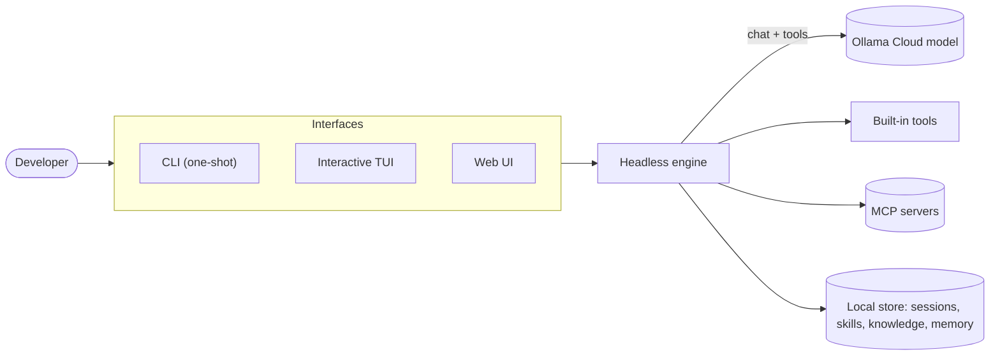
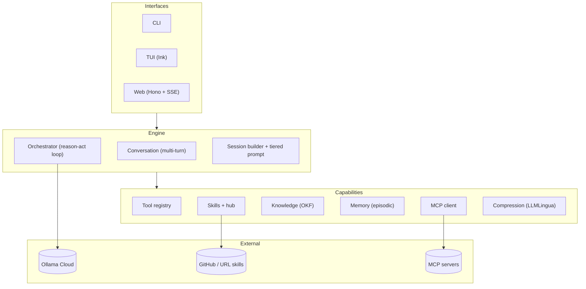
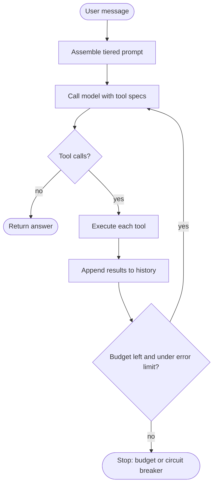
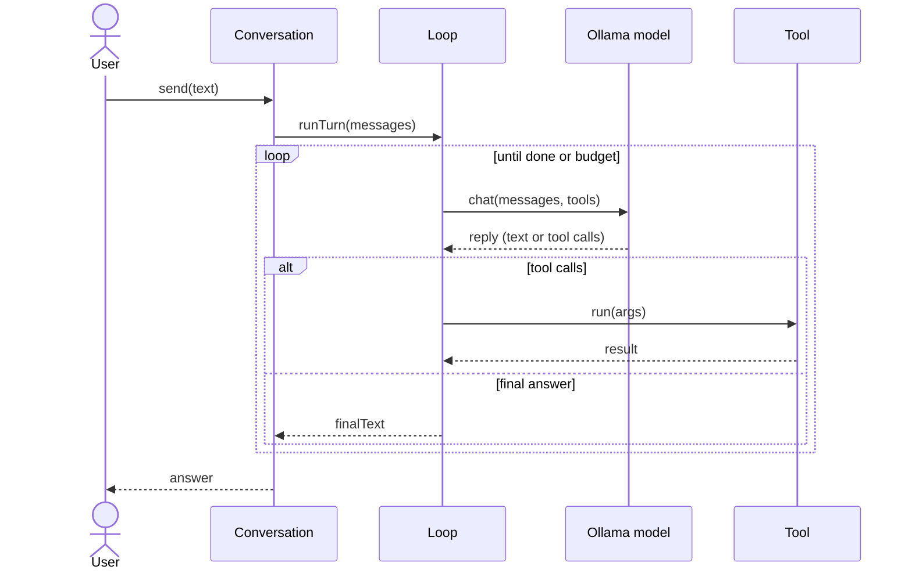
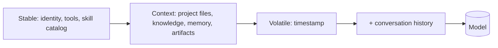
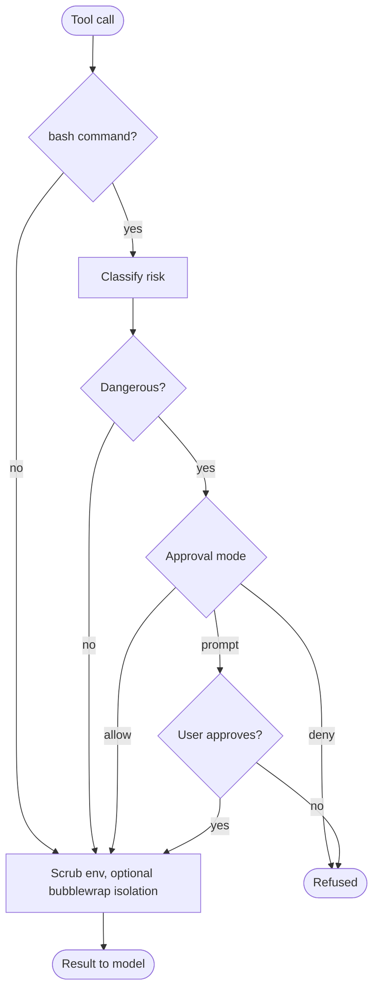
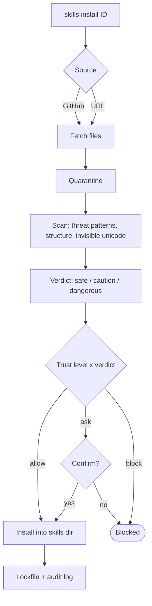
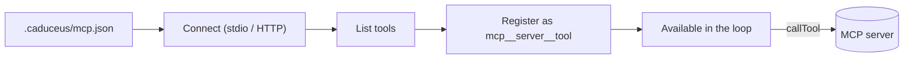

# High-Level Design


Caduceus is a single-agent coding assistant. You give it a task in the terminal
or the browser; it reads the workspace, edits files, runs commands, and verifies
its work in a bounded reason-act loop. This document is the high-level map. For
detail see [ARCHITECTURE.md](ARCHITECTURE.md); for the research behind the
choices see [REFERENCES.md](REFERENCES.md).

## 1. System context

Who talks to what.



## 2. Architecture layers

The three interfaces share one engine, which draws on a set of capabilities.



## 3. The agent loop

Each turn is a bounded loop: think, act with tools, feed results back, repeat
until the model answers or the budget runs out.



## 4. Anatomy of a turn

How a single `send` flows through the components.



## 5. Context assembly

The system prompt is rebuilt every turn in a fixed order, so the long prefix
stays stable and cache-friendly.



## 6. Tool execution: approval and sandbox

Before a shell command runs it is classified for risk and, if flagged, gated;
every tool subprocess gets a scrubbed environment and optional OS isolation.



## 7. Skills hub: safe install

Community skills are downloaded to quarantine, scanned, and only installed if
the trust level and scan verdict allow it. Provenance is recorded.



## 8. MCP integration

External Model Context Protocol servers extend the toolset at runtime.



## 9. On-disk layout

State lives beside the project; nothing is hidden in a database.

```text
<workspace>/
  skills/                 installed skills (SKILL.md folders)
    .hub/                 hub state: lock.json, audit.log, taps.json, quarantine
  knowledge/              OKF concept files
  memory/                 episodic lessons
  artifacts/              large artifacts pulled on demand
  .caduceus/
    sessions/             saved multi-turn sessions
    mcp.json              MCP server configuration
```

## 10. Design principles

The shape of the system follows the evidence gathered before any code was
written (see [REFERENCES.md](REFERENCES.md)):

- Single agent, not multi-agent: decentralization amplifies errors and degrades
  coding results.
- The scaffold is the product: the same model swings tens of points on
  benchmarks from context and tool-call management alone.
- Context is a tiered, file-like store assembled per turn, not an ever-growing
  buffer.
- A lean toolset that grows through Skills rather than a pile of built-ins.
